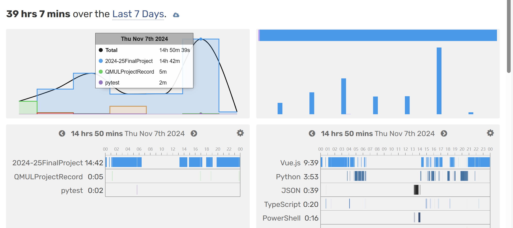
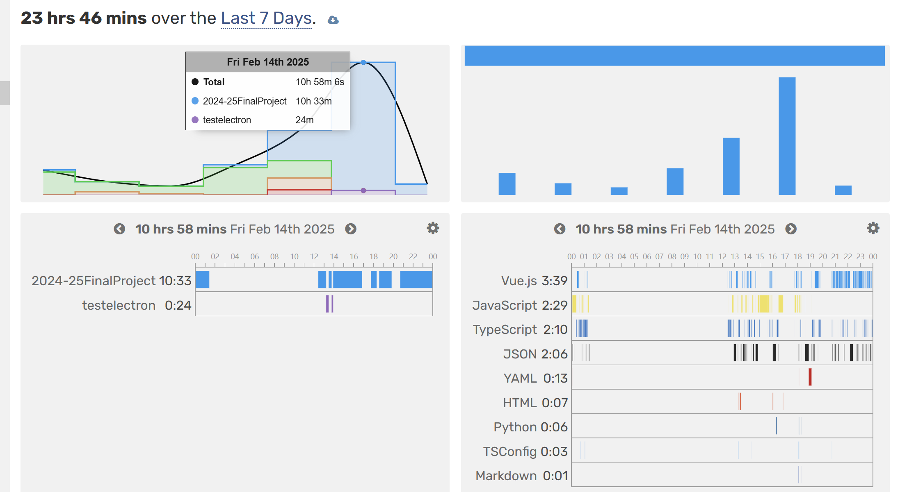

# 毕设
好像也没什么想说的，就是太麻烦了还有填一堆表格，什么甘特图什么中期目标   
明明一个月就能干完的活…

# commit规范
| commit信息 | 触发action动作 |
| --- | --- |
| apifix | api版本号patch更新 |
| apifeat | api版本号minor更新 |
| apibreaking | api版本号major更新 |
| elefix | electron版本号patch更新 |
| elefeat | electron版本号minor更新 |
| elebreaking | electron版本号major更新 |

`注意，后三个触发时会同步更新package.json中的版本号`


# 编译
[](https://wakatime.com/badge/user/0985cb7f-21b8-4ea5-86a4-5e6ba93cb575/project/3eb63dd6-fb69-469e-a7de-4cd19eb6617.svg)   

backend， 产物在dist，开发环境python=3.12.7（2025.2.13 更新至3.12.9）:   
```conda
cd backend
conda activate FinalProject
pip install -r requirements.txt
python pyi_auto_pack_ci.py win (or linux)
```

vue前端, 产物在dist:   
```npm
cd frontend
pnpm install
pnpm build-only
```

electron, 产物在build:   
```npm
cd frontend
pnpm electron-builder --win (or --linux)
```

# 运行
### windows 安装版，或者免安装版   
无论哪种都需要一个控制台，所以双击启动会有一个无输出的控制台弹出，关闭就无法运行了   
通过控制台启动，可以看到错误信息   

### ubuntu 免安装版 以0.2.1版本为例      
解压tar.gz   
```bash
mkdir App
tar -zxvf GuestLiangElectronApp-0.2.1.tar.gz -C ./App 
```
在控制台运行
```bash
cd ./App
./guestliang-electron-app --no-sandbox --disable-gpu
```

# 启动警告
```powershell
You have 18 unapplied migration(s). Your project may not work properly until you apply the migrations for app(s): admin, auth, contenttypes, sessions.
Run 'python manage.py migrate' to apply them.
```
正常现象，如果想解决就   
windows
```bash
.\DjangoRestfulAPI.exe migrate
```
ubuntu
```bash
./DjangoRestfulAPI migrate
```

# 开发
后端启动
```powershell
python manage.py runserver
```
前端启动
```powershell
pnpm dev
```
electron启动
```powershell
pnpm electron
```
electron错误提示
```powershell
npm install electron-fix -g
electron-fix start
```

### 2024.11.7
   
### 2025.2.14

